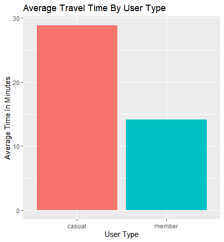
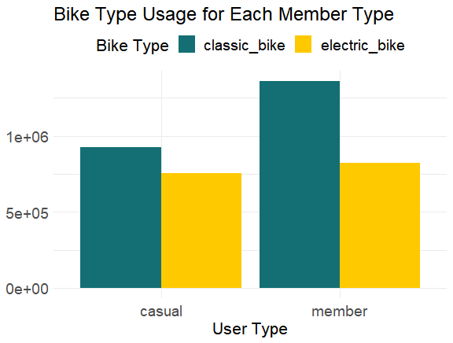
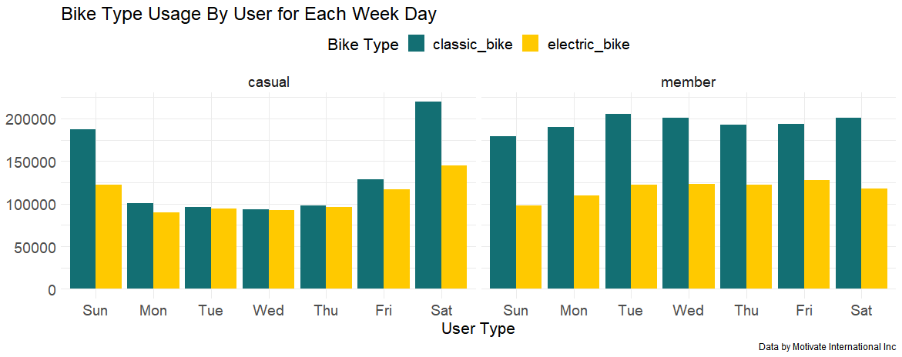
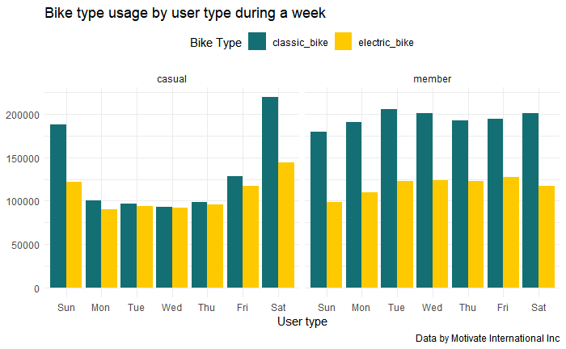
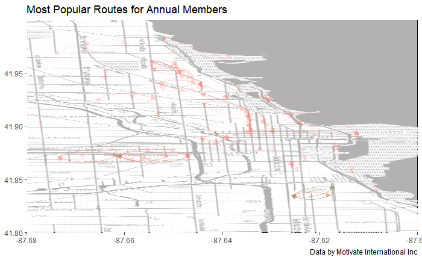
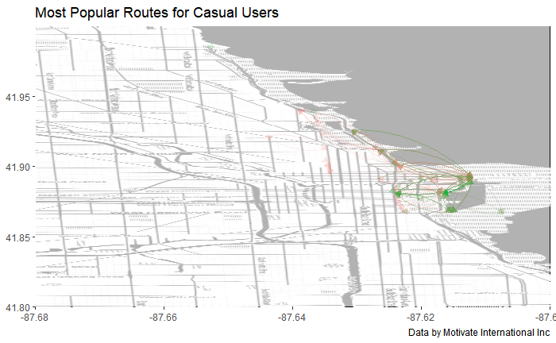

# About

This analysis is for a Capstone Project from the Google Data Analytics Certificate. The project is based on the case study "Sophisticated, Clear, and Polished: Divvy and Data Visualization" written by Kevin Hartman (found here: https://artscience.blog/home/divvy-dataviz-case-study). We will be using the Divvy data set for our analysis. This project aims to collect, prepare, process, and analyze our given data source. Then share our data insights and visualizations to answer the key business question the scenario: "In what ways do the members and the casual riders use Divvy bikes differently?"

# Scenario

In the given scenario, I am a data analyst working in the marketing analyst team at Cyclistic, a bike-share company in Chicago. The director of marketing believes the company's future success depends on maximizing the number of annual memberships. My team aims to understand how casual riders and annual members use Cyclistic bikes differently. These insights will help the marketing team design a new marketing strategy to convert casual riders into annual members.

**Key Stakeholders:**

* Primary Stakeholders - the director of marketing
* Secondary Stakeholders - the marketing analytics team and the executive team

**Business Task:**

Analyze the Cyclistic’s historical trip data from the past 12 months to identify trends that differ between annual members and casual riders.

**Data Sources:**

The datasets used for this analysis are made available by Motivate Internation Inc. under this [licence](https://www.divvybikes.com/data-license-agreement). 

[Data Source link](https://divvy-tripdata.s3.amazonaws.com/index.html)

The data source is public and can be used to explore the different customer types. 

**Notes:** 

* The data privacy issues prohibit us from using riders’ personally identifiable information meaning that we can not connect past purchases to credit card numbers to determine if casual riders live in the Cyclistic service area or have purchased multiple passes.
* Cyclistic is a fictional company; hence the datasets contain the name of a different company. For this analysis, the given datasets can be used for our business task.
* The period analyzed is 12 months, from August 01, 2020, to September 31, 2020. 
* The data being souced can be relied on as the datasets are comprehensive, recent and initially sourced by Motivate Internation In, and appropriately licenced and cited. 

**List of Data Sets:**

* 202009-divvy-tripdata 
* 202010-divvy-tripdata
* 202011-divvy-tripdata
* 202012-divvy-tripdata
* 202101-divvy-tripdata
* 202102-divvy-tripdata
* 202103-divvy-tripdata
* 202104-divvy-tripdata
* 202105-divvy-tripdata
* 202106-divvy-tripdata
* 202107-divvy-tripdata
* 202108-divvy-tripdata


**Required R Packages:**

```{r}
install.packages("tidyverse")
library(tidyverse)
library(ggplot2)
library(dplyr)
library(grid)
install.packages("lubridate")
library(lubridate)
install.packages("ggmap")
library(ggmap)
install.packages("sqldf")
library(sqldf)
install.packages("geosphere")
library(geosphere)
install.packages("gridBase")
library(gridBase)
install.packages("gridExtra")
library(gridExtra)

```

# Preparing Data for Analysis

**Uploading the 12 data files from the past 12 months of the year:**

```{r}
library(readr)
X202009_divvy_tripdata <- read_csv("~/Project_1/202009-divvy-tripdata.csv")
X202010_divvy_tripdata <- read_csv("~/Project_1/202010-divvy-tripdata.csv")
X202011_divvy_tripdata <- read_csv("~/Project_1/202011-divvy-tripdata.csv")
X202012_divvy_tripdata <- read_csv("~/Project_1/202012-divvy-tripdata.csv")
X202101_divvy_tripdata <- read_csv("~/Project_1/202101-divvy-tripdata.csv")
X202102_divvy_tripdata <- read_csv("~/Project_1/202102-divvy-tripdata.csv")
X202103_divvy_tripdata <- read_csv("~/Project_1/202103-divvy-tripdata.csv")
X202104_divvy_tripdata <- read_csv("~/Project_1/202104-divvy-tripdata.csv")
X202105_divvy_tripdata <- read_csv("~/Project_1/202105-divvy-tripdata.csv")
X202106_divvy_tripdata <- read_csv("~/Project_1/202106-divvy-tripdata.csv")
X202107_divvy_tripdata <- read_csv("~/Project_1/202107-divvy-tripdata.csv")
X202108_divvy_tripdata <- read_csv("~/Project_1/202108-divvy-tripdata.csv")
```

**Comparing column names in each of the files:**

```{r}
colnames(X202009_divvy_tripdata)
colnames(X202010_divvy_tripdata)
colnames(X202011_divvy_tripdata)
colnames(X202012_divvy_tripdata)
colnames(X202101_divvy_tripdata)
colnames(X202102_divvy_tripdata)
colnames(X202103_divvy_tripdata)
colnames(X202104_divvy_tripdata)
colnames(X202105_divvy_tripdata)
colnames(X202106_divvy_tripdata)
colnames(X202107_divvy_tripdata)
colnames(X202108_divvy_tripdata)
```

**Notes:**

* All column names in each file have the exact same names.

**Inspecting the data frames and look for inconsistencies:**

```{r}
str(X202009_divvy_tripdata)
str(X202010_divvy_tripdata)
str(X202011_divvy_tripdata)
str(X202012_divvy_tripdata)
str(X202101_divvy_tripdata)
str(X202102_divvy_tripdata)
str(X202103_divvy_tripdata)
str(X202104_divvy_tripdata)
str(X202105_divvy_tripdata)
str(X202106_divvy_tripdata)
str(X202107_divvy_tripdata)
str(X202108_divvy_tripdata)
```

**Notes** Files "X202009_divvy_tripdata", "X202009_divvy_tripdata", and "X202009_divvy_tripdata" have numerical columns on start_station_id and end_station_id.  The rest of the files have characters for these columns, which means these files need to be changed to characters so that they can stack correctly.

**Changing files Columns from numerical to character:**

```{r}
X202009_divvy_tripdata <- mutate(X202009_divvy_tripdata, start_station_id = as.character(start_station_id), 
                   end_station_id = as.character(end_station_id))
X202010_divvy_tripdata <- mutate(X202010_divvy_tripdata, start_station_id = as.character(start_station_id), 
                   end_station_id = as.character(end_station_id))
X202011_divvy_tripdata <- mutate(X202011_divvy_tripdata, start_station_id = as.character(start_station_id), 
                   end_station_id = as.character(end_station_id))
```

**Stacking all 12 individual data frames into one data frame ("all_trips"):**

```{r}
all_trips <- bind_rows(X202009_divvy_tripdata, X202010_divvy_tripdata, X202011_divvy_tripdata, X202012_divvy_tripdata, X202101_divvy_tripdata, X202102_divvy_tripdata, X202103_divvy_tripdata, X202104_divvy_tripdata, X202105_divvy_tripdata, X202106_divvy_tripdata, X202107_divvy_tripdata, X202108_divvy_tripdata)
```


**Inspecting columns and data types for the new data frame:**

```{r}
str(all_trips) 
summary(all_trips)
```
**Notes:**
* No corrections are needed for the next steps.

**Observations for each rider type:**

```{r}
table(all_trips$member_casual)
```
**Notes:**
* For casual there are 2225089 observations and for member there are 2687983 observations.

**Adding New Columns "date", "month", "day", and "year" for each trip:**

```{r}
all_trips$date <- as.Date(all_trips$started_at)
all_trips$month <- format(as.Date(all_trips$date), "%B")
all_trips$day <- format(as.Date(all_trips$date), "%d")
all_trips$year <- format(as.Date(all_trips$date), "%Y")
all_trips$day_of_week <- format(as.Date(all_trips$date), "%a")
```

**Calculating the ride length and adding it as a new column ("ride_length"):**

```{r}
all_trips$ride_length <- difftime(all_trips$ended_at, all_trips$started_at, units = "mins")

```

**Inspecting the structure of the new columns:**

```{r}
str(all_trips)
summary(all_trips)
```

**Notes:**
* Need to convert the column "ride_length" from factor to numeric for further calculations.

**Converting column "ride_length" from factor to numeric:**

```{r}
is.factor(all_trips$ride_length)
all_trips$ride_length <- as.numeric(as.character(all_trips$ride_length))
is.numeric(all_trips$ride_length)
```

**Inspecting the summary of the data set:**

```{r}
summary(all_trips)
```


**Notes:**
* The ride_length Min is -29049.97 minutes and the Max is 55944.15 minutes for our analyse we will reduce the data set to only "ride_length" columns values between o and 24 hours.

**Remove trips that the ride length is <= 0 or more than one day (1440 minutes) and make a copy for the cleaned data frame("all_trips_v2"):**

```{r}
all_trips_v2 <- all_trips[!(all_trips$ride_length > 1440 | all_trips$ride_length <= 0),]
str(all_trips_v2)
```
# Analyzing The Data

**Setting up plot theme elements:**

```{r}
my_theme = theme(plot.title=element_text(size=18),
                 axis.text.x=element_text(size=14), 
                 axis.text.y=element_text(size=14),
                 axis.title.x=element_text(size=16), 
                 axis.title.y=element_text(size=16),
                 strip.text.x=element_text(size=14), 
                 strip.text.y=element_text(size=14),
                 legend.title=element_text(size=16), 
                 legend.text=element_text(size=14))
```

**Analyzing the average ride time for both the casual and member type users:**

```{r}
userType_means <- all_trips_v2 %>% group_by(member_casual) %>% summarise(mean_time = mean(ride_length))

membervstime <- ggplot(userType_means) + 
                geom_col(mapping=aes(x=member_casual,y=mean_time,fill=member_casual), show.legend = FALSE)+
                labs(title = "Average Travel Time By User Type",x="User Type",y="Average Time In Minutes")


grid.arrange(membervstime, ncol = 1) + my_theme  
```


**Notes:**

* The casual riders spend on average about twice as much time on a ride then the members.

**Analyzing the number of rides by user type for each week day:**

```{r}
all_trips_v2 %>% 
  mutate(weekday = wday(started_at, label = TRUE)) %>% 
  group_by(member_casual, weekday) %>% 
  summarise(number_of_rides = n()
            ,average_duration = mean(ride_length),.groups = 'drop') %>% 
  arrange(member_casual, weekday)  %>% 
  ggplot(aes(x = weekday, y = number_of_rides, fill = member_casual)) +
  geom_col(position = "dodge") +
  labs(title = "Number of Rides by User Type for Each Day",x="Days of the week",y="Number of rides",caption = "Data by Motivate International Inc", fill="User type") +
  theme(legend.position="top") + my_theme
```


**Notes:** 
* The annual members use the serve more consistently throughout the week days well the causal member use the serve mostly on the weekend.

**Creating a new data frame using only the rows with info in the "bike_type" column and analyzing which bike type causal and member perfer:**

```{r}
with_bike_type <- all_trips_v2 %>% filter(rideable_type=="classic_bike" | rideable_type=="electric_bike")

with_bike_type %>%
    group_by(member_casual,rideable_type) %>%
    summarise(totals=n(), .groups="drop")  %>%

ggplot()+
    geom_col(aes(x=member_casual,y=totals,fill=rideable_type), position = "dodge") + 
    labs(title = "Bike Type Usage for Each Member Type",x="User Type",y=NULL, fill="Bike Type") +
    scale_fill_manual(values = c("classic_bike" = "#136F73","electric_bike" = "#FFC900")) +
    theme_minimal() +
    theme(legend.position="top") + my_theme
```


**Notes:**
* Both type seem to prefer the classic bikes however there is a more clear preference with the annual members for the classic bikes.

**Analyzing which bike type causal and member use most on each day of the week:**

```{r}
with_bike_type %>%
    mutate(weekday = wday(started_at, label = TRUE)) %>% 
    group_by(member_casual,rideable_type,weekday) %>%
    summarise(totals=n(), .groups="drop") %>%

ggplot(aes(x=weekday,y=totals, fill=rideable_type)) +
  geom_col(, position = "dodge") + 
  facet_wrap(~member_casual) +
  labs(title = "Bike Type Usage By User for Each Week Day",x="User Type",fill="Bike Type" ,y=NULL,caption = "Data by Motivate International Inc") +
  scale_fill_manual(values = c("classic_bike" = "#136F73","electric_bike" = "#FFC900")) +
  theme_minimal() +
  theme(legend.position="top") + my_theme
```


**Notes:**
* On a weekly basis for the annual members the bike type usage is fairly consistent throughout the weekday whereas for the casual users are not consistent  and have a clear preference for the classic bikes on the weekends and no clear preference for either during the rest of the week.

**Analyzing bike usage between members and casual riders by day of week across the year:**

```{r}
options(repr.plot.width = 10, repr.plot.height = 5)

all_trips_v2 %>% 
  group_by(month, day_of_week, member_casual) %>% 
  summarize(number_of_rides = n(), .groups = 'drop') %>% 
  drop_na() %>% 
  ggplot(aes(x = day_of_week, y = number_of_rides, fill = member_casual)) +
  geom_col(position = "dodge") +
  scale_y_continuous(labels = scales::comma) +
  facet_grid(member_casual~month) +
  labs(x = "Day of Week", y = "Number of Rides", fill = "Member/Casual",
       title = "Bike Usage between Members and Casual Riders by Day of Week across the Year", fill = 'Member/Casual') +
  theme(axis.text.x = element_text(angle = 90)) +
  my_theme
```


**Notes:**
* notessss

**Creating a table for the most popular routes (>250 times) and two sub tables for each user type:**

```{r}
coordinates_table <- all_trips_v2 %>% 
filter(start_lng != end_lng & start_lat != end_lat) %>%
group_by(start_lng, start_lat, end_lng, end_lat, member_casual, rideable_type) %>%
summarise(total = n(),.groups="drop") %>%
filter(total > 250)

casual <- coordinates_table %>% filter(member_casual == "casual")
member <- coordinates_table %>% filter(member_casual == "member")
```

**Storing boundary box coordinates for the Chicago area and the stamen map of Chicago:**

```{r}
chi_bb <- c(
  left = -87.680000,
  bottom = 41.800000,
  right = -87.600000,
  top = 42.000000)

chicago_stamen <- get_stamenmap(
  bbox = chi_bb,
  zoom = 13,
  maptype = "toner")
```

**Plotting the concordance on the Chicago map:**

```{r}
ggmap(chicago_stamen,darken = c(0.7, "white")) +
   geom_curve(casual, mapping = aes(x = start_lng, y = start_lat, xend = end_lng, yend = end_lat, alpha= total, color=rideable_type), size = 0.5, curvature = .2,arrow = arrow(length=unit(0.2,"cm"), ends="first", type = "closed")) +
    coord_cartesian() +
    labs(title = "Most Popular Routes for Casual Users",x=NULL,y=NULL, color="User type", caption = "Data by Motivate International Inc") +
    theme(legend.position="none")

ggmap(chicago_stamen,darken = c(0.7, "white")) +
    geom_curve(member, mapping = aes(x = start_lng, y = start_lat, xend = end_lng, yend = end_lat, alpha= total, color=rideable_type), size = 0.5, curvature = .2,arrow = arrow(length=unit(0.2,"cm"), ends="first", type = "closed")) +  
    coord_cartesian() +
    labs(title = "Most Popular Routes for Annual Members",x=NULL,y=NULL, caption = "Data by Motivate International Inc") +
    theme(legend.position="none")
```




**Notes:**
* We can see that the most popular routes are the casual members in the central area by the bay; this could be because many casual members are tourists. On the map for the annual members, the most popular routes are longer in the distance and are in the more local areas.    


